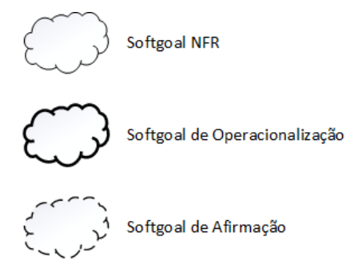
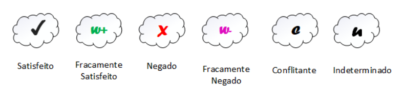

# NFR Framework

## Introdução

O Framework de Requisitos Não Funcionais (NFR Framework - Non-Functional Requirements Framework) é uma abordagem fundamental para definir, gerenciar e priorizar requisitos que não estão diretamente ligados às funcionalidades do sistema, mas sim às características que influenciam sua qualidade geral. Esses requisitos incluem aspectos como desempenho, segurança, escalabilidade, usabilidade e confiabilidade, todos cruciais para garantir que o sistema proporcione uma experiência consistente e satisfatória para os usuários.

O framework utiliza o conceito de softgoals, que são objetivos não claramente definidos ou mensuráveis de forma direta, mas que representam intenções de qualidade que o sistema deve atender. No caso de um site, por exemplo, um softgoal poderia ser "garantir tempos de resposta rápidos" ou "assegurar a proteção dos dados pessoais dos usuários". Esses softgoals podem estar interconectados, mostrando como a priorização ou a satisfação de um requisito pode influenciar outros.

Para organizar e analisar esses requisitos, o NFR Framework faz uso de um gráfico chamado Softgoal Interdependency Graph (SIG). Esse gráfico mapeia as interdependências entre softgoals, incluindo suas possíveis soluções e as justificativas por trás das decisões tomadas. No site de recomendações de restaurantes, o SIG poderia, por exemplo, evidenciar como a implementação de um cache no servidor contribui para melhorar o desempenho, ao mesmo tempo que introduz desafios adicionais relacionados à consistência dos dados.

Os softgoals são divididos em três tipos principais (Figura 1), que desempenham papéis distintos no desenvolvimento da arquitetura do site:

* Softgoals NFR: Representam os requisitos não funcionais diretamente relacionados à qualidade do sistema, como a segurança dos dados dos usuários, a escalabilidade do sistema para suportar um grande número de acessos simultâneos ou compatibilidade com dispositivos móveis. Esses requisitos podem ser organizados hierarquicamente para guiar decisões de arquitetura ao longo do projeto.

* Softgoals de Operacionalização: Relacionam-se com as soluções implementadas para atender aos softgoals NFR, como a escolha de tecnologias específicas para garantir a alta performance, a arquitetura de banco de dados para garantir a integridade das avaliações e o uso de criptografia para proteger os dados dos usuários.

* Softgoals de Afirmação: Consideram características específicas do domínio, como a priorização de desempenho em horários de pico ou a carga de trabalho em servidores. Esses softgoals ajudam a justificar as decisões tomadas e a revisar ou ajustar a arquitetura conforme necessário.

Para o projeto de um site de recomendações de restaurantes, a aplicação do NFR Framework ajuda a estruturar as decisões de desenvolvimento, garantindo que os requisitos não funcionais sejam considerados desde as etapas iniciais do projeto, promovendo a entrega de um sistema de alta qualidade e alinhado às expectativas dos stakeholders. Além disso, esses softgoals fornecem uma estrutura para o desenvolvimento e a avaliação contínua do sistema, permitindo que as decisões sejam fundamentadas em justificativas claras e conectadas a objetivos de qualidade do serviço.

<b>Figura 1:</b> Representação dos tipos de softgoal.

<b>Fonte:</b> (CHUNG et al., 2000).</a>

O processo de avaliação tem como objetivo determinar o grau de cumprimento dos requisitos não funcionais, utilizando um conjunto estruturado de decisões. Em essência, esse processo verifica se cada softgoal ou interdependência representada no SIG foi adequadamente atendida. Para isso, são atribuídos rótulos aos softgoals, que indicam seu estado de satisfação. Os rótulos disponíveis incluem: "satisfeito", "fracamente satisfeito", "negado", "fracamente negado", "conflitante" e "indeterminado".

A figura 2 apresenta exemplos ilustrativos de cada um desses rótulos, conforme extraído do trabalho de Reinaldo Antônio da Silva [1]. Essa mesma figura será utilizada como referência para interpretar os estados dos NFRs abordados neste documento.

<b>Figura 2:</b> Rótulos da propagação de impactos.

<b>Fonte:</b> (CHUNG et al., 2000).</a>

## Metodologia

Neste documento, serão apresentads x NFRs. Para cada categoria, foi feito um SIG (Softgoal Interdependency Graph), um diagrama da propagação de impactos e um cartão de especificação, que possui informações sobre o NFR, como a descrição, a categoria, os conflitos, a origem, os critérios e outras informações.

## NFR Framework

### NFR01 - Usabilidade 

_explicação..._

#### Softgoal Interdependency Graph

O Softgoal Interdependency Grap do softgoal "Usabilidade" pode ser visto na figura 3.

<b>Figura 3:</b> Softgoal Interdependency Grap do softgoal "Usabilidade".

<b>Fonte:</b> <a href="xxx">xxx</a>, 2024

#### Propagação de Impactos

<b>Figura 4:</b> Propagação de Impactos do softgoal "Usabilidade".

<b>Fonte:</b> <a href="xxx">xxx</a>, 2024

#### Cartão de Especificação

### NFR02 - Confiabilidade (Reliability)

_explicação..._

#### Softgoal Interdependency Graph

O Softgoal Interdependency Grap do softgoal "Confiabilidade" pode ser visto na figura 5.

<b>Figura 5:</b> Softgoal Interdependency Grap do softgoal "Confiabilidade".

<b>Fonte:</b> <a href="xxx">xxx</a>, 2024

#### Propagação de Impactos

<b>Figura 6:</b> Propagação de Impactos do softgoal "Confiabilidade".

<b>Fonte:</b> <a href="xxx">xxx</a>, 2024

#### Cartão de Especificação

### NFR03 - Desempenho

_explicação..._

#### Softgoal Interdependency Graph

O Softgoal Interdependency Grap do softgoal "Desempenho" pode ser visto na figura 7.

<b>Figura 7:</b> Softgoal Interdependency Grap do softgoal "Desempenho".

<b>Fonte:</b> <a href="xxx">xxx</a>, 2024

#### Propagação de Impactos

<b>Figura 8:</b> Propagação de Impactos do softgoal "Desempenho".

<b>Fonte:</b> <a href="xxx">xxx</a>, 2024

#### Cartão de Especificação

### NFR04 - Suporte

_explicação..._

#### Softgoal Interdependency Graph

O Softgoal Interdependency Grap do softgoal "Suporte" pode ser visto na figura 9.

<b>Figura 9:</b> Softgoal Interdependency Grap do softgoal "Suporte".

<b>Fonte:</b> <a href="xxx">xxx</a>, 2024

#### Propagação de Impactos

<b>Figura 10:</b> Propagação de Impactos do softgoal "Suporte".

<b>Fonte:</b> <a href="xxx">xxx</a>, 2024

#### Cartão de Especificação

### NFR05 - Restrições de Design

_explicação..._

#### Softgoal Interdependency Graph

O Softgoal Interdependency Grap do softgoal "Restrições de Design" pode ser visto na figura 11.

<b>Figura 11:</b> Softgoal Interdependency Grap do softgoal "Restrições de Design".

<b>Fonte:</b> <a href="xxx">xxx</a>, 2024

#### Propagação de Impactos

<b>Figura 12:</b> Propagação de Impactos do softgoal "Restrições de Design".

<b>Fonte:</b> <a href="xxx">xxx</a>, 2024

#### Cartão de Especificação

### NFR06 - Ajuda e documentação

_explicação..._

#### Softgoal Interdependency Graph

O Softgoal Interdependency Grap do softgoal "Ajuda e documentação" pode ser visto na figura 13.

<b>Figura 13:</b> Softgoal Interdependency Grap do softgoal "Ajuda e documentação".

<b>Fonte:</b> <a href="xxx">xxx</a>, 2024

#### Propagação de Impactos

<b>Figura 14:</b> Propagação de Impactos do softgoal "Ajuda e documentação".

<b>Fonte:</b> <a href="xxx">xxx</a>, 2024

#### Cartão de Especificação

### NFR07 - Interfaces

O aplicativo deve possuir uma interface simples, de fácil navegação e padronizada para que os usuários possam atingir seus objetivos. Os requisitos não-funcionais para interfaces foram classificados em três frentes: interface de usuário, interface de hardware e interface de comunicação.

#### Softgoal Interdependency Graph

O Softgoal Interdependency Grap do softgoal "Interfaces" pode ser visto na figura 15.

<b>Figura 15:</b> Softgoal Interdependency Grap do softgoal "Interfaces".

<b>Fonte:</b> <a href="xxx">xxx</a>, 2024

#### Propagação de Impactos

Após a definição do SIG, foi feita a análise de propagação de impactos do softgoal "Interfaces". O resultado dessa análise pode ser visto na Figura 16.

<b>Figura 16:</b> Propagação de Impactos do softgoal "Interfaces".

<b>Fonte:</b> <a href="xxx">xxx</a>, 2024

#### Cartão de Especificação

## Bibliografia

> SERRANO, Maurício;  SERRANO, Milene. Requisitos - Aula 17. Local: UnB-FGA, Gama, DF. Apresentação de Power Point. Disponível em: [Requisitos - Aula 17](https://aprender3.unb.br/pluginfile.php/2692836/mod_resource/content/1/Requisitos%20-%20Aula%20019a.pdf). Acesso em: 03 de novembro de 2023.
> 

## Referências Bibliográficas

> [1] SILVA, Reinaldo Antônio da. NFR4ES: Um Catálogo de Requisitos Não-Funcionais para Sistemas Embarcados. Universidade Federal de Pernambuco, 2019. Disponível em: <https://aprender3.unb.br/pluginfile.php/2692835/mod_resource/content/2/DISSERTA%C3%87%C3%83O%20Reinaldo%20Ant%C3%B4nio%20da%20Silva.pdf>. Acesso em: 02 de novembro de 2023.

## Histórico de Versão

| Versão | Data | Descrição | Autor | Revisor |
| :----: | ---- | --------- | ----- | ------- |
| `1.0`  |20/11/2024| Inclusão da Introdução e da Metodologia | [Zenilda Vieira](https://github.com/zenildavieira) |  |