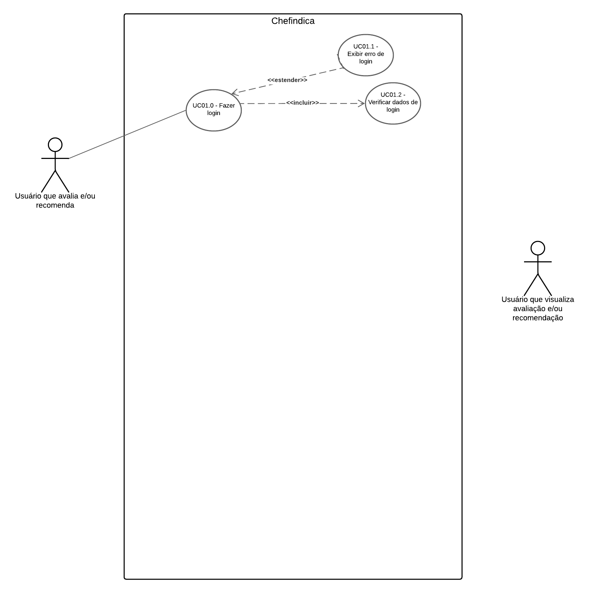

# Diagrama de Casos de Uso

## Introdução
O diagrama de casos de uso é uma representação visual que modela as interações entre os atores externos e o sistema, destacando os principais serviços ou funcionalidades oferecidos. Ele descreve o comportamento do sistema do ponto de vista do usuário, auxiliando na definição de requisitos funcionais. No contexto de um site de recomendações de restaurantes, esse tipo de diagrama é valioso para mapear interações como buscar informações sobre restaurantes avaliados ou registrar novas avaliações.

Além de facilitar a modelagem dos cenários principais de uso, o diagrama de casos de uso também desempenha um papel importante na comunicação com stakeholders, apresentando de forma simplificada as funcionalidades e serviços planejados. Por isso, é amplamente utilizado desde as etapas iniciais da coleta de requisitos, como em entrevistas, reuniões e workshops. Ele também serve como documentação gráfica do escopo funcional, oferecendo aos gerentes de projetos uma visão organizada e acessível sobre as funcionalidades que o sistema deve implementar. [1]

## Metodologia
A construção dos casos de uso do site de recomendação de restaurantes ChefIndica foi feita baseada nos cenários criados na Entrega 01 da disciplina. Primeiro, foram definidos dois atores que interagem com o sistema: o usuário que cadastra uma avaliação/recomendação de um restaurante e o usuário que pesquisa um determinado restaurante, seja pelo nome, seja pela categoria, e visualiza suas recomendações e avaliações. Após a definição de todos os casos de uso, criou-se o diagrama na plataforma Lucid Chart de forma colaborativa com os elementos gráficos padrões de um Caso de Uso (Tabela 1) e seus respectivos relacionamentos seguindo o guia da plataforma Lucid Chart [2].

<b>Tabela 1:</b> Legenda do diagrama de caso de uso

<table>
  <thead>
    <tr>
      <th>Elemento</th>
      <th>Nome</th>
      <th>Função</th>
    </tr>
  </thead>
  <tbody>
    <tr>
      <td><figure class="usecaseElement" style="width: 20%; display: flex;"></figure></td>
      <td>Ator</td>
      <td>xxx</td>
    </tr>
    <tr>
      <td><figure class="usecaseElement" style="width: 40%; display: flex;"></figure></td>
      <td>Elipse (Caso de Uso)</td>
      <td>xxx</td>
    </tr>
    <tr>
      <td><figure class="usecaseElement" style="width: 40%; display: flex;"></figure></td>
      <td>Retângulo (Sistema)</td>
      <td>xxx</td>
    </tr>
    <tr>
      <td><figure class="usecaseElement" style="width: 40%; display: flex;"></figure></td>
      <td>Flecha (Relações)</td>
      <td>xxx</td>
    </tr>
  </tbody>
</table>

<b>Fonte:</b> <a href="https://github.com/Lucas13032003">Lucas Victor</a>, 2024

## Diagrama de Casos de Uso

A figura 1 demonstra o diagrama de casos de uso resultante.

<b>Figura 1:</b> Diagrama de caso de uso do site ChefIndica

<b>Fonte:</b> <a href="https://github.com/Caiomesvie">Caio Mesquita</a>, <a href="https://github.com/cqcoding">Cecília Quaresma</a>, <a href="https://github.com/VieiraLaris">Larissa Vieira</a>, <a href="https://github.com/LuaMedeiros">Luana Medeiros</a>, <a href="https://github.com/lucas13032003">Lucas Victor</a>, <a href="https://github.com/Maliz30">Maria Alice</a> e <a href="https://github.com/zenildavieira">Zenilda Vieira</a>, 2024

## Especificação dos Casos de Uso

### UC01.0 Fazer login

A tabela 2 demonstra a especificação do caso de uso UC01.0 Fazer login.

<b>Tabela 2:</b> Especificação do caso de uso UC01.0

| UC01.0 |  Fazer login |
| --- | --- |
| **Ator(es)** | Usuário que vai cadastrar uma avaliação e/ou recomendação.|
| **Frequência de uso** | Média |
| **Pré-condições** | PRE01. Dispor de uma conexão à internet;  PRE02. Usuário abrir o site deslogado.|
| **Fluxo básico** | <b>FB01. </b> <ol> <li> O usuário fornece seus dados de login. Aciona o caso de uso UC01.2.<li> O usuário é logado. <li> Fim do caso de uso. </ol> |
| **Fluxos alternativos** | --- |
| **Fluxos de exceção** | <b>FE01: Dados do login errados </b> <ol> <li> O usuário fornece algum dado do login errado <li> O sistema informa qual campo está com o dado inválido. Aciona o caso de uso UC01.1. </ul> </ol> |
| **Pós-condições** |POS01. O usuário é logado em sua conta do site. |
| **Data da criação** | 19/11/2024 |
| **Rastreabilidade** |  |

<b>Fonte:</b> <a href="https://github.com/ZenildaVieira">Zenilda Vieira</a>, 2024

### UC01.1. Exibir erro de login

A tabela 3 demonstra a especificação do caso de uso UC01.1 Exibir erro de login.

<b>Tabela 3:</b> Especificação do caso de uso UC01.1

| UC01.1 | Exibir erro de login |
| -: | :- |
| **Ator(es)** | Sistema |
| **Frequência de uso** | Baixa |
| **Pré-condições** | PRE01. O usuário forneceu algum dado errado no login.|
| **Fluxo básico** |<b>FB01. </b> <ol> <li> O usuário fornece seus dados de login. Aciona o caso de uso UC01.2. <li> O sistema informa em qual campo o usuário forneceu um dado inválido </ol> |
| **Fluxos alternativos** | --- |
| **Fluxos de exceção** | --- |
| **Pós-condições** |POS01. O usuário deve colocar novamente suas credenciais de login. |
| **Data da criação** | 19/11/2024 |
| **Rastreabilidade** | |

<b>Fonte:</b> <a href="https://github.com/ZenildaVieira">Zenilda Vieira</a>, 2024

### UC01.2. Verificar dados de login

A tabela 4 demonstra a especificação do caso de uso UC01.2 Verificar dados de login.

  

<b>Tabela 4:</b> Especificação do caso de uso UC01.2

| UC01.2 |  Verificar dados de login |
| -: | :- |
| **Ator(es)** | Sistema |
| **Frequência de uso** | Média |
| **Pré-condições** | PRE01. O usuário fornceceu os dados de login.|
| **Fluxo básico** |<b>FB01. </b> <ol> <li> O sistema recebe os dados que o usuário forneceu. <li> O sistema verifica os dados de login. <li> O sistema libera o login do usuário. <li> Fim do caso de uso. |
| **Fluxos alternativos** | --- |
| **Fluxos de exceção** | <b>FE01: Dados do login errados </b> <ol> <li> O usuário fornece algum dado do login errado. <li> O sistema verifica os dados de login. aciona o caso de uso UC01.1. <li> O sistema não permite o login do usuário. Aciona o caso de uso UC01. <li> Fim do caso de uso. </ul> </ol> |
| **Pós-condições** |POS01. O usuário é logado em sua conta do aplicativo. |
| **Data da criação** |19/11/2024 |
| **Rastreabilidade** |  |

<b>Fonte:</b> <a href="https://github.com/ZenildaVieira">Zenilda Vieira</a>, 2024

### UC02. Fazer Cadastro Usuário

A tabela 5 demonstra a especificação do caso de uso UC02 Fazer Cadastro Usuário.

<b>Tabela 5:</b> Especificação do caso de uso UC02

| UC02 |  Fazer Cadastro Usuário |
| -: | :- |
| **Ator(es)** |  |
| **Frequência de uso** |  |
| **Pré-condições** | |
| **Fluxo básico** | |
| **Fluxos alternativos** |   |
| **Fluxos de exceção** |  |
| **Pós-condições** |  |
| **Data da criação** | |
| **Rastreabilidade** |  |

<b>Fonte:</b> <a href="https://github.com/lucas13032003">Lucas Victor</a>, 2024

 

### UC03. Avaliar Restaurante

A tabela 6 demonstra a especificação do caso de uso UC03 Avaliar Restaurante.

<b>Tabela 6:</b> Especificação do caso de uso UC03

| UC03 |  Avaliar Restaurante |
| -: | :- |
| **Ator(es)** | Usuário |
| **Frequência de uso** | Baixa |
| **Pré-condições** | PRE01. Dispor de uma conexão à internet. PRE02. Usuário estar logado no aplicativo.|
| **Fluxo básico** |  **FB01.**  <ol> <li>O usuário realiza uma pesquisa de restaurantes no aplicativo.<li>O usuário seleciona um restaurante da lista de resultados.<li>O sistema exibe as informações detalhadas do restaurante selecionado.<li>O usuário seleciona a opção “Comentar”.<li>O sistema exibe os campos para a nota e o comentário.<li>O usuário fornece a nota e, opcionalmente, um comentário.<li>O usuário clica em "Avaliar".<li>O sistema registra a avaliação.<li>Fim do caso de uso. </ol>|
| **Fluxos alternativos** |  **FA01: Avaliar sem comentário**   <ol> <li>O usuário escolhe apenas a nota e não fornece comentário.<li>O sistema registra a avaliação com a nota e sem comentário.<li>Fim do caso de uso.  |
| **Fluxos de exceção** |  **FE01: Falha ao registrar avaliação**  <ol> <li>O sistema não consegue registrar a avaliação devido a erro de comunicação ou outro erro técnico.<li>O sistema informa que houve um erro e solicita ao usuário tentar novamente. </ol> **FE02: Usuário não logado**  <ol> <li>O usuário tenta avaliar sem estar logado.<li>O sistema informa que é necessário estar logado para avaliar. O usuário é direcionado para a tela de login. </ol>|
| **Pós-condições** | POS01. A avaliação do restaurante foi registrada com sucesso. |
| **Data da criação** |20/11/2024|
| **Rastreabilidade** |  |

<b>Fonte:</b> <a href="https://github.com/VieiraLaris">Larissa Vieira</a>, 2024

### UC04.  Fazer Comentário

A tabela 7 demonstra a especificação do caso de uso UC04  Fazer Comentário.

<b>Tabela 7:</b> Especificação do caso de uso UC04

| UC04 |  Fazer Comentário |
| -: | :- |
| **Ator(es)** |  |
| **Frequência de uso** |  |
| **Pré-condições** | |
| **Fluxo básico** | |
| **Fluxos alternativos** |   |
| **Fluxos de exceção** |  |
| **Pós-condições** |  |
| **Data da criação** | |
| **Rastreabilidade** |  |

<b>Fonte:</b> <a href="https://github.com/cqcoding">Cecília Quaresma</a>, 2024

### UC05. Pesquisar por Restaurante

A tabela 8 demonstra a especificação do caso de uso UC05 Pesquisar por Restaurante.

<b>Tabela 8:</b> Especificação do caso de uso UC05

| UC05 |  Pesquisar por Restaurante |
| -: | :- |
| **Ator(es)** |  |
| **Frequência de uso** |  |
| **Pré-condições** | |
| **Fluxo básico** | |
| **Fluxos alternativos** |   |
| **Fluxos de exceção** |  |
| **Pós-condições** |  |
| **Data da criação** | |
| **Rastreabilidade** |  |

<b>Fonte:</b> <a href="https://github.com/Caiomesvie">Caio Mesquita</a>, 2024

 

### UC06. Filtrar por Categoria

A tabela 9 demonstra a especificação do caso de uso UC06 Filtrar por Categoria.

<b>Tabela 9:</b> Especificação do caso de uso UC06

| UC06 |  Filtrar por Categoria |
| -: | :- |
| **Ator(es)** |  |
| **Frequência de uso** |  |
| **Pré-condições** | |
| **Fluxo básico** | |
| **Fluxos alternativos** |   |
| **Fluxos de exceção** |  |
| **Pós-condições** |  |
| **Data da criação** | |
| **Rastreabilidade** |  |

<b>Fonte:</b> <a href="https://github.com/Maliz30">Maria Alice</a>, 2024

### UC07. Cadastrar Restaurante

A tabela 10 demonstra a especificação do caso de uso UC07 Cadastrar Restaurante.

<b>Tabela 10:</b> Especificação do caso de uso UC07

| UC07 |  Cadastrar Restaurante |
| -: | :- |
| **Ator(es)** | Usuário |
| **Frequência de uso** | Média |
| **Pré-condições** | PRE01. O usuário deve estar logado no aplicativo.   PRE02. Dispor de uma conexão à internet. |
| **Fluxo básico** |  **FB01.**  <ol> <li>O usuário acessa a opção "Cadastrar Restaurante" no menu do aplicativo.<li> O sistema exibe um formulário para preenchimento.<li>O usuário insere as informações necessárias, como foto, nome, local e categoria. <li>O usuário confirma o cadastro clicando em "Adicionar".<li>O sistema valida os dados fornecidos. <li>O sistema registra o restaurante na base de dados. <li>O sistema exibe uma mensagem de sucesso confirmando o cadastro. <li>Fim do caso de uso. </ol>|
| **Fluxos alternativos** |  **FA01: Restaurante já cadastrado**   <ol> <li>O sistema verifica que o restaurante informado já existe na base de dados.<li>O sistema exibe uma mensagem informando que o restaurante já está cadastrado e sugere ao usuário verificar as informações ou buscar diretamente pelo nome.<li>O sistema não permite um novo cadastro para o mesmo restaurante.<li>Fim do caso de uso.  |
| **Fluxos de exceção** |  **FE01: Falha na validação dos dados**   <ol> <li>O sistema identifica que um ou mais campos obrigatórios estão ausentes ou preenchidos incorretamente.<li>O sistema informa ao usuário quais campos precisam ser corrigidos e solicita a revisão dos dados.<li>O usuário corrige os dados e tenta novamente.<li>Fim do caso de uso. </ol> **FE02: Falha ao registrar o restaurante**   <ol> <li>O sistema não consegue registrar o restaurante devido a erro técnico ou falta de conexão com a base de dados.<li>O sistema exibe uma mensagem de erro ao usuário e solicita que ele tente novamente mais tarde.<li>Fim do caso de uso. </ol> |
| **Pós-condições** | POS01. O restaurante foi cadastrado com sucesso e está disponível para consulta no aplicativo. |
| **Data da criação** | 21/11/2024 |
| **Rastreabilidade** |  |

<b>Fonte:</b> <a href="https://github.com/LuaMedeiros">Luana Medeiros</a>, 2024

## Referências Bibliográficas

> [1] REINEHR, Sheila. Engenharia de requisitos. Porto Alegre: Grupo A, 2020. E-book. ISBN 9786556900674. Disponível em: <https://integrada.minhabiblioteca.com.br/#/books/9786556900674/>. Acesso em: 19 de novembro de 2024.
> 
> [2] Lucid Software Português. Tutorial de Caso de Uso UML [Recurso eletrônico: vídeo], 2019.  Disponível em: <https://www.youtube.com/watch?v=ab6eDdwS3rA>.  Acesso em: 19 de novembro de 2024.

## Histórico de Versão

| Versão | Data | Descrição | Autor | Revisor |
| :----: | ---- | --------- | ----- | ------- |
| `1.0`  |18/11/2024| Adição da introdução | [Luana Medeiros](https://github.com/LuaMedeiros) | [Zenilda Vieira](https://github.com/zenildavieira) |
| `1.1`  |19/11/2024| Complementação da introdução, inclusão da metodologia,   criação do padrão das tabelas de especificações e inclusão do caso de uso UC01 | [Zenilda Vieira](https://github.com/zenildavieira) | [Luana Medeiros](https://github.com/LuaMedeiros) |
| `1.2`  |20/11/2024| Adição do caso de uso UC03 | [Larissa Vieira](https://github.com/VieiraLaris) | [Luana Medeiros](https://github.com/LuaMedeiros) |
| `1.3`  |21/11/2024| Adição do caso de uso UC07 | [Luana Medeiros](https://github.com/LuaMedeiros) |  |
